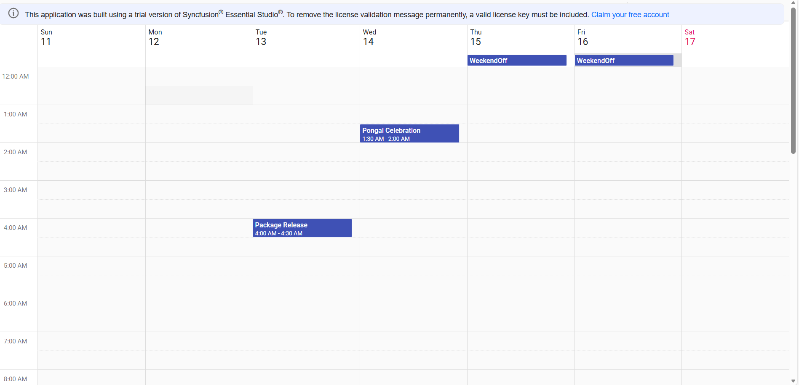
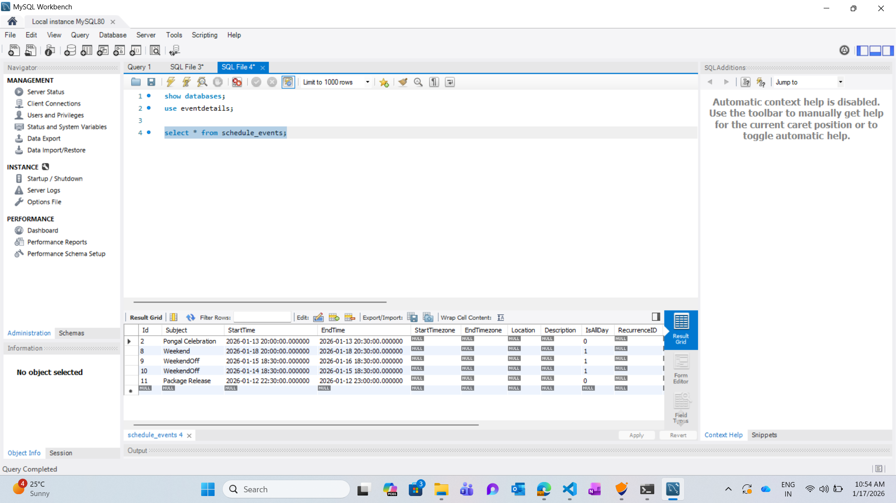

<!--
  howto.md
  A step-by-step guide to integrate MySQL with Syncfusion React Scheduler using Django 
-->

# How to integrate MySQL with Syncfusion React Scheduler using Django

This repository contains a sample full-stack application demonstrating how to synchronize events between MySQL database and the Syncfusion React Scheduler component using Django.The React frontend provides a responsive UI for viewing and managing  events.

## Prerequisites
- Node.js (>= 18.0)
- npm (>= 8.0)
- Python(>= 10.3.1)
- DJango(>= 6.0.1)
- MySQL(>= 8.0.41.0)
- React(>= 18.3)
- A MySQL Database with Username and Password (create at https://dev.mysql.com/downloads/installer/)
- Basic familiarity with React, Python and MySQL Query
- Make sure the ports nothing run on 8000 , 3000

## Project Structure
```
├── README.md                           # This guide
├── backend                             # backend configuration
│   ├── scheduler   
│   │    ├── _init_.py
│   │    ├── asgi.py
│   │    ├── settings.py                # Connect Database
│   │    ├── urls.py
│   │    ├── wsgi.py
│   ├── schedulerCrud  
│   │    ├── migrations
|   │    │    ├──  _init_.py 
│   │    ├── _init_.py
│   │    ├── admin.py
│   │    ├── apps.py
│   │    ├── models.py                 # Table Structure
│   │    ├── serializers
│   │    ├── tests.py
│   │    ├── urls.py
│   │    ├── views.py                  # Process Scheduler CRUD Request
│   ├── manage.py                      # Starting the server
├── public
│    ├── index.html
├── src
│    ├── App.css       
│    ├── App.test.tsx
│    ├── App.tsx                        # Scheduler Configuration
│    ├── index.css
│    ├── index.tsx
│    ├── logo.svg
│    ├── react-app-env.d.ts
│    ├── setupTests.ts  
├── package.json
│── tsconfig.json

```
## Setup


### Cloning the repository
    
- Clone the repository to your local machine

### Backend Setup

### Installation
- Run the following command to install the required packages
    ```
    pip install django-cors-headers
    pip install djangorestframework
    pip install pymysql
    pip install dj-database-url
    pip install mysqlclient
    ```
- Go to the backend directory 
### MySQL Configuration
- Create a MySQL user with a chosen username and password and create a new database`.
- In `backend/scheduler/settings.py` file update the USER, PASSWORD, and DB as per the database configuration.

    ```ini
    NAME=<Your-database-name>
    USER=<your-user-name>
    PASSWORD=<password-for-specific-user>
    ```
- We need to create table in the mysql database. Run the following command to create the table

    ```
   python manage.py makemigrations

   python manage.py migrate

   ```
### Start Backend Server
- Open `backend` folder in terminal and run `python manage.py runserver` command to start the backend server.

    ```
    python manage.py runserver
    ```
### Available Endpoints
The Django server (`views.py`) exposes the following REST routes:
| Method | URL                          | Description                         |
| ------ | ---------------------------- | ----------------------------------- |
| GET    | `Home/GetData`    | List events in the given time range |
| POST   | `Home/UpdateData`                | Create a new ,edit and delete event. 

### Frontend Setup

### Start Syncfusion React Scheduler 

- Open another terminal, on the root directory, run the following command to install the required packages
    ```
    npm install
    ```
- Start the Scheduler 
    ```
    npm start
    ```
### Running the Application
1. Navigate to backend folder
      ```bash
    cd backend
    ```
2. Start the backend server:
    ```bash
    python manage.py runserver
    ```
3. Server started running on `http://localhost:8000`
4. Start the frontend:
    ```bash
    npm start
    ```
5. Navigate to [`http://localhost:3000`](http://localhost:3000) in your browser.

6. You can perform CRUD operation on the scheduler that will be reflected in the MySQL database table.
 

## Output Preview

*Image illustrating the Syncfusion React Scheduler*


*Image illustrating the events of Syncfusion React Scheduler in MYSQL*

## Troubleshooting
- **401 Unauthorized**: Check `NAME` `User` and `Password`.
- **CORS errors**: Ensure frontend calls runs on `localhost:3000`

<br/>
<br/>
<br/>

## A step by step guide integrate Syncfusion React Scheduler with MySQL using Django.

### Frontend Setup

1. Create a Syncfusion React Scheduler by following this [getting started](https://ej2.syncfusion.com/react/documentation/schedule/getting-started?cs-save-lang=1&cs-lang=js).

    Create a react app by run the following Command
    ```bash
    npm create vite@latest my-app
    ```
    or    

    To set-up a React application in JavaScript environment, run the following command.
    ```bash
    npm create vite@latest my-app -- --template react-ts
    ```
2. Install the Required Packages in frontend by following commands
    ```bash
        npm install @syncfusion/ej2-react-schedule
        npm install @testing-library/jest-dom
        npm install @testing-library/react
        npm install @testing-library/user-event
        npm install @types/jest
        npm install @types/node
        npm install @types/react
        npm install @types/react-dom
        npm install typescript@4.9.5
        npm install react
        npm install react-dom
        npm install react-scripts
        npm install web-vitals

    ```
    After that you replace this lines in scripts and add browserslist in package.json to defines commands with npm

    ```bash
        
        "scripts": {
          "start": "react-scripts start",
          "build": "react-scripts build",
          "test": "react-scripts test",
          "eject": "react-scripts eject"
        },
        "browserslist": {
            "production": [
              ">0.2%",
              "not dead",
              "not op_mini all"
            ],
            "development": [
              "last 1 chrome version",
              "last 1 firefox version",
              "last 1 safari version"
            ]
        }

    ```
3. Replace `App.tsx` file in `src` folder to define url and crudurl also define schedule component
    ```bash

    import React from 'react';
    import './App.css';
    import { ScheduleComponent, Day, Week, WorkWeek, Month, Agenda, Inject, DragAndDrop, Resize } from '@syncfusion/ej2-react-schedule';
    import { DataManager, UrlAdaptor } from '@syncfusion/ej2-data';

    function App() {
    
      let dataManager: DataManager = new DataManager({
        url: 'http://127.0.0.1:8000/Home/GetData',
        crudUrl: 'http://127.0.0.1:8000/Home/UpdateData/',
        adaptor: new UrlAdaptor(),
        crossDomain: true
      });

      return (
        <ScheduleComponent eventSettings={{ dataSource: dataManager }}>
          <Inject services={[Day, Week, WorkWeek, Month, Agenda, DragAndDrop, Resize]}/>
        </ScheduleComponent>
      );
    }

    export default App;

    ```
4. Create a `index.tsx` in src folder to call the App Component and update the Id root according to index.html.
    ```bash
        import React from 'react';
        import ReactDOM from 'react-dom/client';
        import App from './App.tsx';
        import reportWebVitals from './reportWebVitals.ts';

        const root = ReactDOM.createRoot(document.getElementById('root')!);
        root.render(
        
            <App />

        );

        // If you want to start measuring performance in your app, pass a function
        // to log results (for example: reportWebVitals(console.log))
        // or send to an analytics endpoint. Learn more: https://bit.ly/CRA-vitals
        reportWebVitals();

    ```
7. Create App.css to load the styles in scheduler
    ```bash
        @import "../node_modules/@syncfusion/ej2-base/styles/material.css";
        @import "../node_modules/@syncfusion/ej2-buttons/styles/material.css";
        @import "../node_modules/@syncfusion/ej2-calendars/styles/material.css";
        @import "../node_modules/@syncfusion/ej2-dropdowns/styles/material.css";
        @import "../node_modules/@syncfusion/ej2-inputs/styles/material.css";
        @import "../node_modules/@syncfusion/ej2-lists/styles/material.css";
        @import "../node_modules/@syncfusion/ej2-navigations/styles/material.css";
        @import "../node_modules/@syncfusion/ej2-popups/styles/material.css";
        @import "../node_modules/@syncfusion/ej2-splitbuttons/styles/material.css";
        @import "../node_modules/@syncfusion/ej2-react-schedule/styles/material.css";
    ```
8. Place the `index.html` inside the `public` folder
    ```bash
        <!DOCTYPE html>
        <html lang="en">
          <head>
            <meta charset="utf-8" />
            <link rel="icon" href="%PUBLIC_URL%/favicon.ico" />
            <meta name="viewport" content="width=device-width, initial-scale=1" />
            <meta name="theme-color" content="#000000" />
            <meta
              name="description"
              content="Web site created using create-react-app"
            />
            <link rel="apple-touch-icon" href="%PUBLIC_URL%/logo192.png" />

            <link rel="manifest" href="%PUBLIC_URL%/manifest.json" />

            <title>React App</title>
          </head>
          <body>
            <noscript>You need to enable JavaScript to run this app.</noscript>
            <div id="root"></div>

          </body>
        </html>

    ```
<br/>
<br/>

### Backend and MySQL Setup
1. Download MySQL from [MySQL](https://dev.mysql.com/downloads/installer/)

2. Create a Username , Password and Database in MySQL

3. Download and install python

4. Install neccesary packages for backend by following commands
    ```bash
        pip install django-cors-headers
        pip install djangorestframework
        pip install pymysql
        pip install dj-database-url
        pip install mysqlclient
    ```

5. Create a `backend` folder

6. Create a `scheduler` folder inside `backend`

7. create `asgi.py` file inside `scheduler` to provide asgi entry point for Django , allowing projects to run on asynchronous servers
    ```bash
        """
        ASGI config for scheduler project.

        It exposes the ASGI callable as a module-level variable named ``application``.

        For more information on this file, see
        https://docs.djangoproject.com/en/4.1/howto/deployment/asgi/
        """

        import os

        from django.core.asgi import get_asgi_application

        os.environ.setdefault('DJANGO_SETTINGS_MODULE', 'scheduler.settings')

        application = get_asgi_application()

    ```


8. Connect database with scheduler by create `settings.py` inside `scheduler` folder in `backend` and replace your `NAME` `USER` and `PASSWORD`  with your credentials
    ```bash
        """
        Django settings for scheduler project.
        
        Generated by 'django-admin startproject' using Django 4.1.7.
        
        For more information on this file, see
        https://docs.djangoproject.com/en/4.1/topics/settings/
        
        For the full list of settings and their values, see
        https://docs.djangoproject.com/en/4.1/ref/settings/
        """
        
        from pathlib import Path
        
        # Build paths inside the project like this: BASE_DIR / 'subdir'.
        BASE_DIR = Path(__file__).resolve().parent.parent
        
        
        # Quick-start development settings - unsuitable for production
        # See https://docs.djangoproject.com/en/4.1/howto/deployment/checklist/
        
        # SECURITY WARNING: keep the secret key used in production secret!
        SECRET_KEY = 'django-insecure-^c3q05432&h%ugyf+z(p+51@q(v)y4eytfqw-z0iv8^hm6%=g+'
        
        # SECURITY WARNING: don't run with debug turned on in production!
        DEBUG = True
        
        ALLOWED_HOSTS = []
        
        
        # Application definition
        
        INSTALLED_APPS = [
            'django.contrib.admin',
            'django.contrib.auth',
            'django.contrib.contenttypes',
            'django.contrib.sessions',
            'django.contrib.messages',
            'django.contrib.staticfiles',
            'corsheaders',
            'rest_framework',
            'schedulerCrud.apps.SchedulercrudConfig'
        ]
        
        MIDDLEWARE = [
            'django.middleware.security.SecurityMiddleware',
            'django.contrib.sessions.middleware.SessionMiddleware',
            'django.middleware.common.CommonMiddleware',
            'django.middleware.csrf.CsrfViewMiddleware',
            'django.contrib.auth.middleware.AuthenticationMiddleware',
            'django.contrib.messages.middleware.MessageMiddleware',
            'django.middleware.clickjacking.XFrameOptionsMiddleware',
            'corsheaders.middleware.CorsMiddleware',
        ]
        
        ROOT_URLCONF = 'scheduler.urls'
        import os
        
        TEMPLATES = [
            {
                'BACKEND': 'django.template.backends.django.DjangoTemplates',
                'DIRS': [os.path.join(BASE_DIR,'syncfusion-scheduler','build')],
                'APP_DIRS': True,
                'OPTIONS': {
                    'context_processors': [
                        'django.template.context_processors.debug',
                        'django.template.context_processors.request',
                        'django.contrib.auth.context_processors.auth',
                        'django.contrib.messages.context_processors.messages',
                    ],
                },
            },
        ]
        
        WSGI_APPLICATION = 'scheduler.wsgi.application'
        
        
        # Database
        # https://docs.djangoproject.com/en/4.1/ref/settings/#databases
        
        DATABASES = {
            'default': {
                'ENGINE': 'django.db.backends.mysql',
                'NAME': 'DatabaseName',
                'USER': 'UserName',
                'PASSWORD': 'Password',
                'HOST': 'localhost',   # Or an IP Address that your DB is hosted on
                'PORT': '3306',
            }
        }
        
        
        # Password validation
        # https://docs.djangoproject.com/en/4.1/ref/settings/#auth-password-validators
        
        AUTH_PASSWORD_VALIDATORS = [
            {
                'NAME': 'django.contrib.auth.password_validation.UserAttributeSimilarityValidator',
            },
            {
                'NAME': 'django.contrib.auth.password_validation.MinimumLengthValidator',
            },
            {
                'NAME': 'django.contrib.auth.password_validation.CommonPasswordValidator',
            },
            {
                'NAME': 'django.contrib.auth.password_validation.NumericPasswordValidator',
            },
        ]
        
        
        # Internationalization
        # https://docs.djangoproject.com/en/4.1/topics/i18n/
        
        LANGUAGE_CODE = 'en-us'
        
        TIME_ZONE = 'UTC'
        
        USE_I18N = True
        
        USE_TZ = True
        
        
        # Static files (CSS, JavaScript, Images)
        # https://docs.djangoproject.com/en/4.1/howto/static-files/
        
        STATIC_URL = 'static/'
        STATICFILES_URL = [BASE_DIR,'syncfusion-scheduler/build/static']
        
        # Default primary key field type
        # https://docs.djangoproject.com/en/4.1/ref/settings/#default-auto-field
        
        DEFAULT_AUTO_FIELD = 'django.db.models.BigAutoField'
        CORS_ORIGIN_ALLOW_ALL = True
        CORS_ALLOW_ALL_HEADERS=True

    ```
9. create `urls.py` file inside `scheduler` 
    ```bash
        from django.urls import path, re_path
        from schedulerCrud import views
        from django.contrib import admin

        # urls.py
        urlpatterns = [
            path('Home/GetData', views.GetData),
            path('Home/UpdateData/', views.UpdateData),
            path('admin/', admin.site.urls),
        ]
    ```
10. create `wsgi.py` file inside `scheduler` to provide wsgi entry point for Django , allowing projects to run on synchronous servers
    ```bash
        """
        WSGI config for scheduler project.

        It exposes the WSGI callable as a module-level variable named ``application``.

        For more information on this file, see
        https://docs.djangoproject.com/en/4.1/howto/deployment/wsgi/
        """

        import os

        from django.core.wsgi import get_wsgi_application

        os.environ.setdefault('DJANGO_SETTINGS_MODULE', 'scheduler.settings')

        application = get_wsgi_application()

    ```
11. Create a `schedulerCrud` folder in `backend`

12. Create a `apps.py` in `SchedulerCrud` folder in `backend`
    ```bash
        from django.apps import AppConfig
        class SchedulercrudConfig(AppConfig):
            default_auto_field = 'django.db.models.BigAutoField'
            name = 'schedulerCrud'
    ```

13. Create a `models.py` in `SchedulerCrud` folder in `backend` to create a table in database. 
    ```bash
        from django.db import models

        # Create your models here.
        from django.db import models

        class ScheduleEvents(models.Model):
            Id = models.IntegerField(primary_key=True)
            Subject = models.CharField(max_length=200, null=True, blank=True)
            StartTime = models.DateTimeField()
            EndTime = models.DateTimeField()
            StartTimezone = models.CharField(max_length=200, null=True, blank=True)
            EndTimezone = models.CharField(max_length=200, null=True, blank=True)
            Location = models.CharField(max_length=200, null=True, blank=True)
            Description = models.CharField(max_length=200, null=True, blank=True)
            IsAllDay = models.BooleanField()
            RecurrenceID = models.IntegerField(null=True, blank=True)
            FollowingID = models.IntegerField(null=True, blank=True)
            RecurrenceRule = models.CharField(max_length=200, null=True, blank=True)
            RecurrenceException = models.CharField(max_length=200, null=True, blank=True)
            IsReadonly = models.BooleanField(null=True, blank=True)
            IsBlock = models.BooleanField(null=True, blank=True)
            RoomID = models.IntegerField(null=True, blank=True)

        class Meta:
            db_table = 'schedule_events'
    ```
14. Create a `serializers.py` in `SchedulerCrud` folder in `backend` to converts the ScheduleEvents model data to JSON and validates incoming API data, allowing the Django REST Framework to handle create, read, update, and delete operations.
    ```bash
        from rest_framework import serializers
        from schedulerCrud.models import ScheduleEvents
        
        class ScheduleEventsSerializer(serializers.ModelSerializer):
            class Meta:
                model = ScheduleEvents
                fields = '__all__'
    ```
15. Create a `urls.py` in `SchedulerCrud` folder in `backend`
    ```bash
        from django.urls import path
        from . import views

        urlpatterns = [
            path('', views.index, name='index'),
        ]
    ```
16. Create a `views.py` in `SchedulerCrud` folder in `backend` to processes Scheduler CRUD requests by creating, updating, or deleting events.
    ```bash
        from django.views.decorators.csrf import csrf_exempt
        from rest_framework.parsers import JSONParser
        from django.http.response import JsonResponse
        from schedulerCrud.serializers import ScheduleEventsSerializer
        from schedulerCrud.models import ScheduleEvents

        # views.py
        @csrf_exempt
        def GetData(request):

                schedule_events = ScheduleEvents.objects.all()
                schedule_events_serializer=ScheduleEventsSerializer(schedule_events,many=True)
                return JsonResponse(schedule_events_serializer.data,safe=False)

        @csrf_exempt
        def UpdateData(request):
            if request.method == 'POST':
                data = JSONParser().parse(request)
                if 'added' in data and len(data['added']) > 0:
                    schedule_events_data = data['added'][0]  # Get the first event from the 'added' list
                    schedule_events_serializer = ScheduleEventsSerializer(data=schedule_events_data)
                    if schedule_events_serializer.is_valid():
                        schedule_events_serializer.save()
                        return GetData(request)            
                    else:
                        return JsonResponse(schedule_events_serializer.errors, safe=False, status=400)

                elif 'changed' in data and len(data['changed']) > 0:
                    for item in data['changed']:
                        event = ScheduleEvents.objects.get(pk=item['Id'])
                        schedule_events_serializer = ScheduleEventsSerializer(event, data=item)
                        if schedule_events_serializer.is_valid():
                            schedule_events_serializer.save()
                            return GetData(request)
                        else:
                            return JsonResponse(schedule_events_serializer.errors, safe=False, status=400)
                    return JsonResponse("Updated Successfully", safe=False)

                elif 'deleted' in data and len(data['deleted']) > 0:
                    for item in data['deleted']:
                        event = ScheduleEvents.objects.get(pk=item['Id'])
                        event.delete()
                    return GetData(request)
                else:
                    return JsonResponse({"error": "No events to add, update or delete"}, status=400)
            else:
                return JsonResponse({"error": "Invalid method"}, status=405)
    

    ```
17. Create a `manage.py` in `backend` to allowing to run administrative tasks such as starting the server
    ```bash
        #!/usr/bin/env python
        """Django's command-line utility for administrative tasks."""
        import os
        import sys


        def main():
            """Run administrative tasks."""
            os.environ.setdefault('DJANGO_SETTINGS_MODULE', 'scheduler.settings')
            try:
                from django.core.management import execute_from_command_line
            except ImportError as exc:
                raise ImportError(
                    "Couldn't import Django. Are you sure it's installed and "
                    "available on your PYTHONPATH environment variable? Did you "
                    "forget to activate a virtual environment?"
                ) from exc
            execute_from_command_line(sys.argv)


        if __name__ == '__main__':
            main()

    ```
### Running the Application
1. Navigate to backend folder
      ```bash
    cd backend
    ```
2. Run the Command to create a table in database
    ```bash
    python manage.py makemigrations

    python manage.py migrate
   ```
2. Start the backend server:
    ```bash
    python manage.py runserver
    ```
3. Server started running on `http://localhost:8000` or you can change the port no
4. Start the frontend:
    ```bash
    npm start
    ```
5. Navigate to [`http://localhost:3000`](http://localhost:3000) in your browser or you can change the port no.

6. You can perform CRUD operation on the scheduler that will be reflected in the MySQL database table.
